# Conception de la Base de Données — Plateforme HSE CIPI ACTIA
## Diagramme de Classes Final & Nouveaux Formulaires Statistiques HSE

---

### 1. Vue d'Ensemble Architecturale

L'architecture relationnelle de la plateforme repose sur le patron **Joined Table Inheritance** (Héritage par Jointure) centré autour de la classe mère abstraite `Form_Submission`.

Cette conception intègre :
1. **Gestion des Utilisateurs & Sécurité** : `Users`, `User_session`, `Pwd_reset_request`.
2. **Formulaires Terrain & Audits Existants** :
   - `Audit_HSE_Submission` & `AuditHse_Items` (FGSI-001 - Ind: F)
   - `Tournee_HSE_Submission` & `TourneeHse_Items` (FGSI-010 - Ind: A)
   - `Permis_de_travail_Submission` (FGSI-PERMIS)
3. **Nouveaux Formulaires Statistiques & Indicateurs HSE** (soumis via les grilles mensuelles) :
   - **Tableau 1** : `Accident_Travail_Submission` & `Accident_Travail_Monthly_Item` (Suivi mensuel des accidents et de la santé)
   - **Tableau 2** : `Taux_Frequence_Submission` & `Taux_Frequence_Monthly_Item` (Taux de Fréquence TF & Indice de Fréquence IF)
   - **Tableau 3** : `Taux_Gravite_Submission` & `Taux_Gravite_Monthly_Item` (Taux de Gravité TG)
   - **Tableau 4** : `Indice_Gravite_Submission` & `Indice_Gravite_Monthly_Item` (Indice de Gravité IG)
4. **Moteur Décisionnel & Dashboard Dynamique** : `KPI_Definit`, `KPI_snapshots`, `Dashboard_widgets`.

---

### 2. Diagramme de Classes UML Final (Mermaid)

```mermaid
classDiagram
    direction TB

    %% ==========================================
    %% 1. AUTHENTIFICATION ET UTILISATEURS
    %% ==========================================
    class Users {
        +int id
        +string full_name
        +string email_unique
        +string hashed_pwd
        +boolean is_active
        +datetime created_at
    }

    class User_session {
        +int id
        +int user_id
        +string refresh_token_hash
        +string access_jti
        +boolean is_active
        +datetime expires_at
        +datetime created_at
        +datetime last_used_at
    }

    class Pwd_reset_request {
        +int id
        +int user_id
        +string email
        +string otp_hash
        +datetime expires_at
        +boolean is_used
        +datetime created_at
    }

    class Refresh_Tokens {
        +int id
        +int user_id
        +string token_hash
        +datetime expires_at
        +boolean is_revoked
    }

    class Token_Blacklist {
        +int id
        +string jti
        +datetime revoked_at
        +datetime expires_at
    }

    class Password_Reset_Tokens {
        +int id
        +int user_id
        +string email
        +string otp_code_hash
        +datetime expires_at
        +boolean is_verified
        +boolean is_used
    }

    Users "1" --> "0..*" User_session : possède
    Users "1" --> "0..*" Pwd_reset_request : possède
    Users "1" --> "0..*" Refresh_Tokens : détient
    Users "1" --> "0..*" Token_Blacklist : révoque
    Users "1" --> "0..*" Password_Reset_Tokens : demande

    %% ==========================================
    %% 2. CLASSE MÈRE POLYMORPHIQUE
    %% ==========================================
    class Form_Submission {
        <<abstract>>
        +int id
        +int user_id
        +string form_type
        +string reference
        +string secteur
        +string intervenant
        +datetime date_submission
        +string commentaires
        +float taux_conformite
        +datetime created_at
        +datetime updated_at
    }

    Users "1" --> "0..*" Form_Submission : soumet

    %% ==========================================
    %% 3. FORMULAIRES TERRAIN EXISTANTS
    %% ==========================================
    class Audit_HSE_Submission {
        +int id
        +int submission_id
        +int totale_conforme
        +int totale_non_conforme
        +int totale_na
        +int count_soldee
        +int count_en_cours
        +int count_en_retard
        +int count_non_engagee
    }

    class AuditHse_Items {
        +int id_PK
        +int audit_id_FK
        +int question_id
        +int section_id
        +Conformite enum_conformite
        +string constat
        +string action_corrective
        +string responsable
        +string delai
        +string etat
        +string commentaire
    }

    class Tournee_HSE_Submission {
        +int id
        +int submission_id
        +int totale_conforme
        +int totale_non_conforme
        +int totale_na
        +int count_soldee
        +int count_non_engage
        +int count_en_cours
        +int count_en_retard
    }

    class TourneeHse_Items {
        +int id_PK
        +int tournee_id_FK
        +int question_id
        +int sect_id
        +Conformite enum_conformite
        +string constat
        +string action_corrective
        +string responsable
        +string delai
        +string etat
        +string commentaire
    }

    class Permis_de_travail_Submission {
        +int id
        +int submission_id
        +int nb_plan_prevention
        +int nb_permis_hauteur
        +int nb_permis_feu
        +string remarques
    }

    class Photo_Storage {
        +int id
        +int item_id
        +string item_type
        +string file_path
        +string original_filename
        +int file_size_kb
        +datetime uploaded_at
    }

    Form_Submission <|-- Audit_HSE_Submission : Hérite
    Form_Submission <|-- Tournee_HSE_Submission : Hérite
    Form_Submission <|-- Permis_de_travail_Submission : Hérite

    Audit_HSE_Submission "1" --> "0..*" AuditHse_Items : contient
    Tournee_HSE_Submission "1" --> "0..*" TourneeHse_Items : contient
    AuditHse_Items "1" --> "0..*" Photo_Storage : illustré par
    TourneeHse_Items "1" --> "0..*" Photo_Storage : illustré par

    %% ==========================================
    %% 4. NOUVEAUX FORMULAIRES STATISTIQUES HSE
    %% ==========================================
    class Accident_Travail_Submission {
        +int id
        +int submission_id
        +int annee
        +int total_accidents
        +int total_accidents_avec_arret
        +int total_accidents_sans_arret
        +float total_heures_travaillees
        +int total_jours_perdus
        +int total_travailleurs
        +int total_visites_medicales
        +int total_maladies_pro
        +float taux_frequence
        +float indice_frequence
        +float taux_gravite
        +float indice_gravite
        +float target_if
        +float target_tf
        +float target_tg
        +float target_ig
    }

    class Accident_Travail_Monthly_Item {
        +int id_PK
        +int submission_id_FK
        +int mois_index
        +string mois_label
        +int nb_accidents_total
        +int nb_accidents_avec_arret
        +int nb_accidents_sans_arret
        +float nb_heures_travaillees
        +int nb_jours_perdus
        +int nb_travailleurs
        +int nb_visites_medicales
        +int nb_maladies_pro
        +float tf_valeur
        +float if_valeur
        +float tg_valeur
        +float ig_valeur
        +float incapacite_permanente
    }

    class Taux_Frequence_Submission {
        +int id
        +int submission_id
        +int annee
        +float target_if
        +float target_tf
        +float tf_annuel_moyen
        +float if_annuel_moyen
    }

    class Taux_Frequence_Monthly_Item {
        +int id_PK
        +int frequence_sub_id_FK
        +int mois_index
        +string mois_label
        +float tf_valeur
        +float if_valeur
        +float target_if
        +int nb_accidents_avec_arret
        +float nb_heures_travaillees
        +int nb_salaries
        +float target_tf
    }

    class Taux_Gravite_Submission {
        +int id
        +int submission_id
        +int annee
        +float target_tg
        +float tg_annuel_moyen
        +int total_jours_incapacite
    }

    class Taux_Gravite_Monthly_Item {
        +int id_PK
        +int gravite_sub_id_FK
        +int mois_index
        +string mois_label
        +float tg_valeur
        +int nb_jours_incapacite
        +float nb_heures_travaillees
        +float target_tg
    }

    class Indice_Gravite_Submission {
        +int id
        +int submission_id
        +int annee
        +float target_ig
        +float ig_annuel_moyen
    }

    class Indice_Gravite_Monthly_Item {
        +int id_PK
        +int indice_gravite_sub_id_FK
        +int mois_index
        +string mois_label
        +float ig_valeur
        +float somme_taux_incapacite_perm
        +float nb_heures_travaillees
        +float target_ig
    }

    Form_Submission <|-- Accident_Travail_Submission : Hérite
    Form_Submission <|-- Taux_Frequence_Submission : Hérite
    Form_Submission <|-- Taux_Gravite_Submission : Hérite
    Form_Submission <|-- Indice_Gravite_Submission : Hérite

    Accident_Travail_Submission "1" --> "12" Accident_Travail_Monthly_Item : détaille par mois
    Taux_Frequence_Submission "1" --> "12" Taux_Frequence_Monthly_Item : détaille par mois
    Taux_Gravite_Submission "1" --> "12" Taux_Gravite_Monthly_Item : détaille par mois
    Indice_Gravite_Submission "1" --> "12" Indice_Gravite_Monthly_Item : détaille par mois

    %% ==========================================
    %% 5. MOTEUR DECISIONNEL DASHBOARD & KPIS
    %% ==========================================
    class KPI_Definit {
        +int id
        +string name
        +string label
        +string description
        +string form_type
        +string source_table
        +string calcul_formule
        +string unite
        +string chart_type
        +boolean is_active
        +float target_value
    }

    class KPI_snapshots {
        +int id
        +int kpi_id
        +int user_id
        +float value
        +json breakdown_data
        +date periode_start
        +date periode_end
        +datetime computed_at
    }

    class Dashboard_widgets {
        +int id
        +int user_id
        +int kpi_id
        +int kpi_snapshot_id
        +int position_x
        +int position_y
        +int width
        +int height
        +json extra_config
    }

    Users "1" --> "0..*" Dashboard_widgets : personnalise
    Users "1" --> "0..*" KPI_snapshots : calcule
    KPI_Definit "1" --> "0..*" KPI_snapshots : configure / alimente
    Dashboard_widgets "0..*" --> "1" KPI_Definit : affiché dans
    KPI_snapshots "1" --> "0..*" Dashboard_widgets : alimente
    Accident_Travail_Submission "1" --> "0..*" KPI_snapshots : alimente
```

---

### 3. Formules Mathématiques et Règles de Calcul

Chaque tableau dispose de ses règles métiers strictes, implémentées avec protection contre la division par zéro (`heures == 0` ou `salariés == 0`) :

#### Tableau 1 : Suivi Mensuel des Accidents du Travail & Santé
* **Règle 1 — Nombre Total d'Accidents (Ligne 1)** :
  $$\text{Nombre d'accident de travail} = \text{Nombre d'accidents avec arrêt} + \text{Nombre d'accidents sans arrêt}$$
  *Ce champ est calculé automatiquement en temps réel et verrouillé en lecture seule.*
* **Champs de saisie** : Tous strictement numériques ($\ge 0$).
* **Lignes en surbrillance jaune** : Heures travaillées, Effectif travailleurs, Visites médicales, Maladies professionnelles.

---

#### Tableau 2 : Taux de Fréquence (TF) et Indice de Fréquence (IF)
* **Formule TF (Taux de Fréquence)** :
  $$\text{TF} = \frac{\text{Nombre d'accidents du travail avec arrêt}}{\text{Nombre d'heures travaillées}} \times 1\,000\,000$$
  *(Nombre d'accidents avec arrêt par million d'heures de travail effectuées).*
* **Formule IF (Indice de Fréquence)** :
  $$\text{IF} = \frac{\text{Nombre d'accidents de travail avec arrêt}}{\text{Nombre des salariés}} \times 1\,000$$
  *(Nombre d'accidents avec arrêt pour 1 000 salariés).*
* **Règle d'alerte visuelle conditionnelle** :
  - Si $\text{IF} > \text{Target IF}$ (ex: $> 2.5$) : **Alerte Rouge** critique.
  - Si $\text{IF} \le \text{Target IF}$ : **Conforme Vert**.

---

#### Tableau 3 : Taux de Gravité (TG)
* **Formule TG** :
  $$\text{TG} = \frac{\text{Nombre total de jours perdus (jours d'incapacité)}}{\text{Nombre d'heures travaillées}} \times 1\,000$$
  *(Nombre de journées indemnisées pour 1 000 heures de travail).*
* **Target TG** : Valeur cible (par défaut $0$).

---

#### Tableau 4 : Indice de Gravité (IG)
* **Formule IG** :
  $$\text{IG} = \frac{\text{Somme des taux d'incapacité permanente}}{\text{Nombre d'heures travaillées}} \times 1\,000$$
* **Target IG** : Valeur cible (par défaut $0$).

---

### 4. Dictionnaire des Tables en Base de Données

| Nom de Table | Type d'Héritage / Relation | Rôle Métier |
|:---|:---|:---|
| `users` | Table Principale | Utilisateurs, comptes responsables et authentification. |
| `refresh_tokens` | Table Sécurité (`users.id`) | Persistance sécurisée des sessions OAuth2/JWT. |
| `token_blacklist` | Table Sécurité | Révocation instantanée des jetons JTI lors des déconnexions. |
| `password_reset_tokens` | Table Sécurité (`users.id`) | Réinitialisation de mot de passe par code OTP sécurisé. |
| `form_submissions` | Table Mère (Joined Table Inheritance) | Métadonnées communes : identifiant, responsable, secteur, date, référence. |
| `audit_hse_submissions` | Table Enfant (`form_submissions.id`) | Fiches d'Audit HSE (FGSI-001) et statistiques de conformité. |
| `audit_hse_items` | Table Détail (`audit_hse_submissions.id`) | Points de contrôle de l'audit (1 à 51), constats et plans d'action. |
| `tournee_hse_submissions` | Table Enfant (`form_submissions.id`) | Fiches de Tournée HSE (FGSI-010) et statistiques terrain. |
| `tournee_hse_items` | Table Détail (`tournee_hse_submissions.id`) | Points de contrôle de la tournée (101 à 142) et actions correctives. |
| `permis_travail_submissions` | Table Enfant (`form_submissions.id`) | Fiches Permis de Travail (plans prévention, hauteur, feu). |
| `photo_storage` | Table Multimédia | Registre centralisé des photos rattachées aux constats d'audit et tournée. |
| `accident_travail_submissions` | Table Enfant (`form_submissions.id`) | Entête annuelle consolidée : accidents, TF, IF, TG, IG et cibles cibles. |
| `accident_travail_monthly_items` | Table Détail 1 $\rightarrow$ 12 | 12 enregistrements mensuels : accidents détaillés, heures, salariés, valeurs TF/IF/TG/IG. |
| `taux_frequence_submissions` | Table Enfant (`form_submissions.id`) | Sous-vue analytique de fréquence et cibles associées. |
| `taux_frequence_monthly_items` | Table Détail 1 $\rightarrow$ 12 | 12 enregistrements mensuels : TF calculé, IF calculé, Heures, Salariés, Target IF. |
| `taux_gravite_submissions` | Table Enfant (`form_submissions.id`) | Sous-vue analytique du taux de gravité. |
| `taux_gravite_monthly_items` | Table Détail 1 $\rightarrow$ 12 | 12 enregistrements mensuels : TG calculé, Jours perdus/incapacité, Heures. |
| `indice_gravite_submissions` | Table Enfant (`form_submissions.id`) | Sous-vue analytique de l'indice de gravité. |
| `indice_gravite_monthly_items` | Table Détail 1 $\rightarrow$ 12 | 12 enregistrements mensuels : IG calculé, Incapacité permanente, Heures. |
| `kpi_definitions` | Catalogue Moteur Décisionnel | Définitions des indicateurs, tables sources, agrégations et formats de graphiques. |
| `kpi_snapshots` | Table Cache Haute Performance | Résultats précalculés pour l'alimentation instantanée du Dashboard (< 10ms). |
| `dashboard_widgets` | Configuration Personnalisée | Grille personnalisée par responsable (position, dimension, KPI rattaché). |

---

### 5. Intégration dans le Catalogue des KPIs (`kpi_definitions`)

Ces nouveaux formulaires alimentent directement les cartes et graphiques du Dashboard :
* `kpi_tf_mensuel` : Taux de Fréquence mensuel et cumul annuel.
* `kpi_if_mensuel` : Indice de Fréquence par rapport à la Target (2.5).
* `kpi_tg_mensuel` : Taux de Gravité mensuel.
* `kpi_ig_mensuel` : Indice de Gravité mensuel.
* `kpi_accidents_total` : Nombre total d'accidents de travail (avec et sans arrêt).
